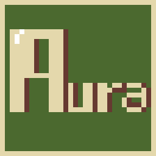

<table>
  <tr>
    <td>
      
    </td>
    <td style="padding-left: 20px;">
      <h2 style="margin: 0;">Aura</h2>
      

        The bare essentials to make your own game. No engine, no editor.
      

      
Bold enough to try it?

    </td>
  </tr>
</table>
